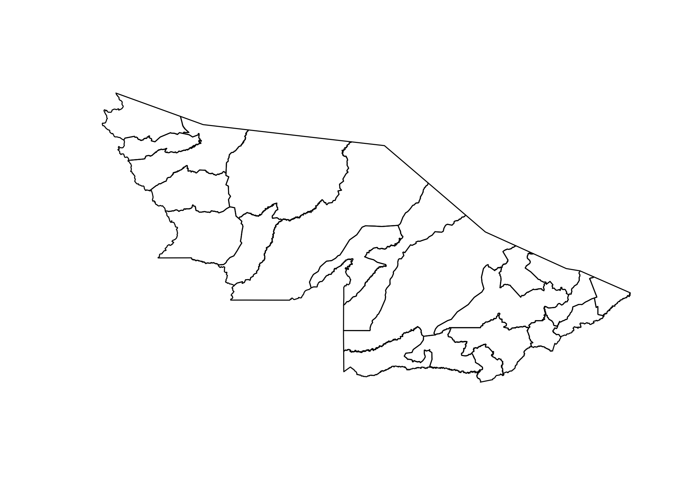

<!-- README.md is generated from README.Rmd. Please edit that file -->
brazilmunis
===========

This simple R package contains shapefiles for all municipalities, micro-regions, and meso-regions in Brazil, as well as data frames of municipality, micro-region, meso-region, state, and region codes and names for each level of geographic resolution.

Installation
------------

``` r
# install.packages("devtools")
devtools::install_github("ki-tools/brazilmunis")
```

Usage
-----

``` r
library(brazilmunis)

sp::plot(subset(br_muni_geo, state_code == "AC"))
```



``` r
sp::plot(br_meso_geo)
```


What is special about using `README.Rmd` instead of just `README.md`? You can include R chunks like so:

``` r
dplyr::glimpse(br_muni_codes)
#> Observations: 5,570
#> Variables: 11
#> $ muni_name   <chr> "Itapuã do Oeste", "Candeias do Jamari", "Nova Mam...
#> $ muni_code   <chr> "1101104", "1100809", "1100338", "1100205", "11001...
#> $ micro_name  <chr> "Porto Velho", "Porto Velho", "Porto Velho", "Port...
#> $ micro_code  <chr> "110001", "110001", "110001", "110001", "110001", ...
#> $ meso_name   <chr> "Porto Velho", "Porto Velho", "Porto Velho", "Port...
#> $ meso_code   <chr> "1101", "1101", "1101", "1101", "1101", "1101", "1...
#> $ state_name  <chr> "Rondônia", "Rondônia", "Rondônia", "Rondônia", "R...
#> $ state_code  <chr> "RO", "RO", "RO", "RO", "RO", "RO", "RO", "RO", "R...
#> $ state_code2 <chr> "BRA-595", "BRA-595", "BRA-595", "BRA-595", "BRA-5...
#> $ region_name <chr> "North", "North", "North", "North", "North", "Nort...
#> $ region_code <chr> "NO", "NO", "NO", "NO", "NO", "NO", "NO", "NO", "N...
```

``` r
dplyr::glimpse(br_micro_codes)
#> Observations: 510
#> Variables: 9
#> $ micro_name  <chr> "Abaeté", "Abaetetuba", "Açailândia", "Acaraú", "A...
#> $ micro_code  <chr> "310070", "150003", "210021", "230017", "240011", ...
#> $ meso_name   <chr> "Divinópolis", "Belém", "Imperatriz", "Sobral", "M...
#> $ meso_code   <chr> "3113", "1501", "2105", "2306", "2403", "3505", "2...
#> $ state_name  <chr> "Minas Gerais", "Pará", "Maranhão", "Ceará", "Rio ...
#> $ state_code  <chr> "MG", "PA", "MA", "CE", "RN", "SP", "PE", "ES", "M...
#> $ state_code2 <chr> "BRA-601", "BRA-594", "BRA-593", "BRA-621", "BRA-6...
#> $ region_name <chr> "Southeast", "North", "Northeast", "Northeast", "N...
#> $ region_code <chr> "SE", "NO", "NE", "NE", "NE", "SE", "NE", "SE", "C...
```

``` r
dplyr::glimpse(br_meso_codes)
#> Observations: 133
#> Variables: 7
#> $ meso_name   <chr> "Altamira", "Aracaju", "Araçatuba", "Araguaína", "...
#> $ meso_code   <chr> "1506", "2801", "3506", "1702", "2702", "3509", "3...
#> $ state_name  <chr> "Pará", "Sergipe", "São Paulo", "Tocantins", "Alag...
#> $ state_code  <chr> "PA", "SE", "SP", "TO", "AL", "SP", "MG", "MT", "B...
#> $ state_code2 <chr> "BRA-594", "BRA-629", "BRA-1311", "BRA-596", "BRA-...
#> $ region_name <chr> "North", "Northeast", "Southeast", "North", "North...
#> $ region_code <chr> "NO", "NE", "SE", "NO", "NE", "SE", "SE", "CO", "N...
```

``` r
dplyr::glimpse(br_state_codes)
#> Observations: 27
#> Variables: 5
#> $ state_name  <chr> "Acre", "Alagoas", "Amapá", "Amazonas", "Bahia", "...
#> $ state_code  <chr> "AC", "AL", "AP", "AM", "BA", "CE", "DF", "ES", "G...
#> $ state_code2 <chr> "BRA-576", "BRA-623", "BRA-681", "BRA-592", "BRA-6...
#> $ region_name <chr> "North", "Northeast", "North", "North", "Northeast...
#> $ region_code <chr> "NO", "NE", "NO", "NO", "NE", "NE", "CO", "SE", "C...
```
